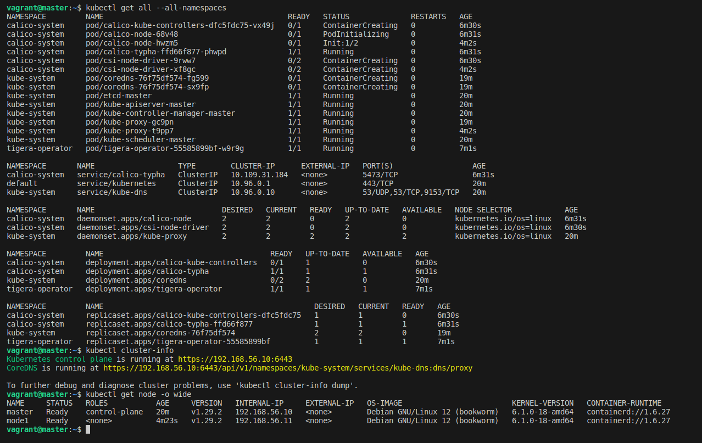

# Creating a multi-node Kubernetes cluster on local machine
This guide will bring you close to a real world use case of Kubernetes, on your local machine!

Requirements:
1. [VirtualBox](https://www.virtualbox.org/) 
2. [Vagrant](https://www.vagrantup.com/) on our machine. 

May God help you if you have less than 4GB of RAM.

For Kubernetes version `1.24+`

## Provisioning VMs with all necessary tools
```sh
$ git clone https://github.com/mosesmbadi/k8s-local-lab.git
$ cd k8s-local-lab
$ vagrant up
$ vagrant reload
```

## Initializing control plane node
After all VMs are provisioned, follow this [guide](https://kubernetes.io/docs/setup/production-environment/tools/kubeadm/create-cluster-kubeadm/) to setup our cluster:

```sh
$ vagrant ssh master
$ sudo kubeadm init --apiserver-advertise-address=192.168.56.10 --pod-network-cidr=10.244.0.0/16
```
Note the token gotten after the above command

```
$ mkdir -p $HOME/.kube
$ sudo cp -i /etc/kubernetes/admin.conf $HOME/.kube/config
$ sudo chown $(id -u):$(id -g) $HOME/.kube/config
```
Let's configure Calico for networking:
```sh
$ kubectl create -f https://raw.githubusercontent.com/projectcalico/calico/v3.27.0/manifests/tigera-operator.yaml
$ kubectl create -f ./shared/helpers/custom-resources.yaml
```


## Joining worker nodes
```sh
$ vagrant ssh node1
$ sudo kubeadm join 192.168.56.10:6443 --token <token> --discovery-token-ca-cert-hash sha256:<hash>
```
We've typed the join command here, but the join command can also be found after running the `kubeadm init`. If you didn't copy it, you can find it again by running the following commands on the master node:

```sh
$ kubeadm token list
$ openssl x509 -pubkey -in /etc/kubernetes/pki/ca.crt | \
   openssl rsa -pubin -outform der 2>/dev/null | \
   openssl dgst -sha256 -hex | sed 's/^.* //'
```

If for some reason you cant find the token, you can regenerate with
```sh
$ kubeadm token create --ttl 8760h
```

Run the same join command on each worker node.

Now we should have a 3-node Kubernetes cluster running on our local machine.
here are some commands you can start with:

```sh
$ vagrant ssh master
$ kubectl get node -o wide
```

```sh
$ kubectl cluster-info
```

```sh
$ kubectl get all --all-namespaces

```





## Kubernetes Dashboard

## Next Steps
Open the Kubernetes Pocket Guide from ./learning-resources
and let the games begin...

If you appreciate free education, feel free to make a donation


Let's deploy an application
```sh
kubectl apply -f  shared/shared/master/manifests
```

Get more info about a pod
```sh
kubectl describe pod <pod-name>
```

Exec into a container
```sh
kubectl exec -it <pod-name> -c <container-name> -- /bin/bash
```

To access your application outside the cluster 
```kubectl get service -n easymed``
This will show you the port the application is running on, assuming you used a NodePort in your service definition
You can then access your application with 
```<node-ipaddress>:port```


To read logs
kubectl logs -l app=easymed-api -n easymed


========================
Troubleshooting
Confirm all scripts ran - by running them manually
If your kubelet is stuck here ``Active: activating``(auto-restart)

type ``sudo swapoff -a`` on each node

If that doesnt work, check kubelet logs
``sudo journalctl -u kubelet -n 100 --no-pager``
That might help you identify the issue

If still facing errors destroy the machines then rebuild without scripts
``vagrant destroy -f``
``vagrant up``

then run the scripts manually in the order shown below
```sh
disable-swap.sh
install-essential-tools.sh
scripts/allow-bridge-nf-traffic.sh
scripts/install-containerd.sh
scripts/install-kubeadm.sh
scripts/update-kubelet-config.sh
```
=====================


[PayPal Donate](https://www.paypal.com/donate/?hosted_button_id=45A3RRNJMNAGQ)
[Bitcoin Donate](bc1q9cymjyzt7zj28zcztjafys0sur329gektd4zzh)